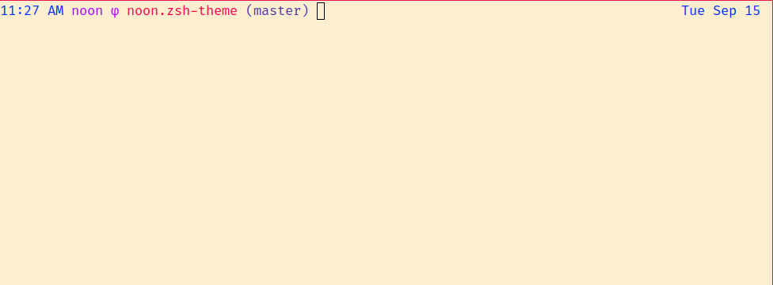

# Noons Zsh Theme

### Dark


### Light




## Installation

You can install it via say zgen:

```
zgen load silky/noon.zsh-theme noon.zsh-theme
```

### Features

- Cool physics symbol: φ

- Super-cool function to export aws-profile environment variables
  (courtesy of [sordina](https://github.com/sordina)):

```
aws-export-profile <profile-name>
```

- Error code appears when error; and terminal goes red.

- Terminal also goes red when in sudo

- Also includes Konsole colour scheme which is neccessary because we use
  colour names now. Put it in `~/.local/share/konsole` to use it.

### Notes

- If you use vim, this almost certainly depends on my [vim
colourscheme](https://github.com/silky/dotfiles/blob/master/vim/colors/noon-light.vim).
