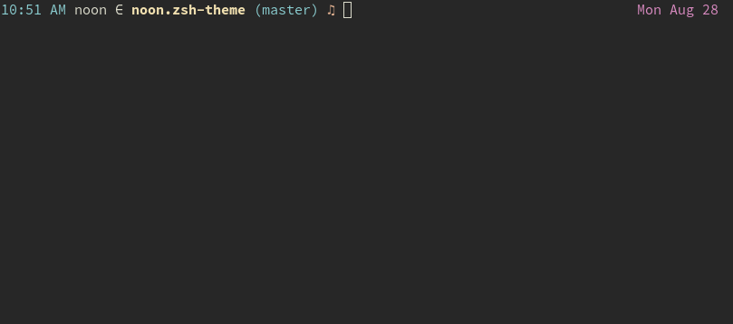

# Noons Zsh Theme



You can install it via say zgen:

```
zgen load silky/noon.zsh-theme noon.zsh-theme
```

### Features

- Cool music symbol: ♫

- Super-cool function to export aws-profile environment variables
  (courtesy of [sordina](https://github.com/sordina)):

```
aws-export-profile <profile-name>
```
